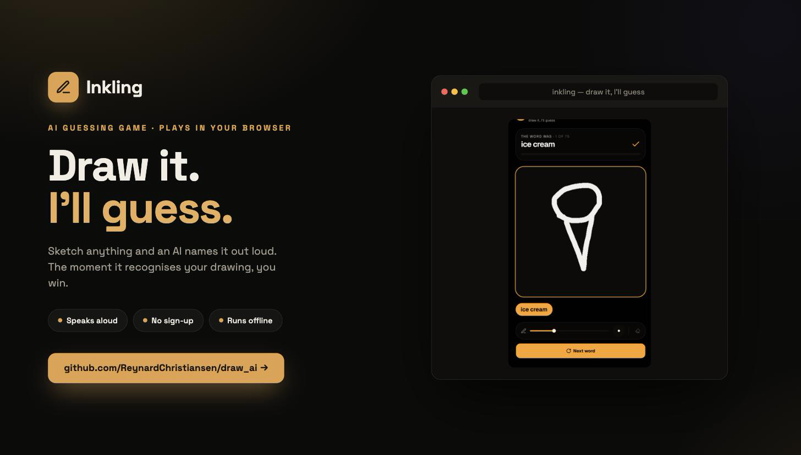
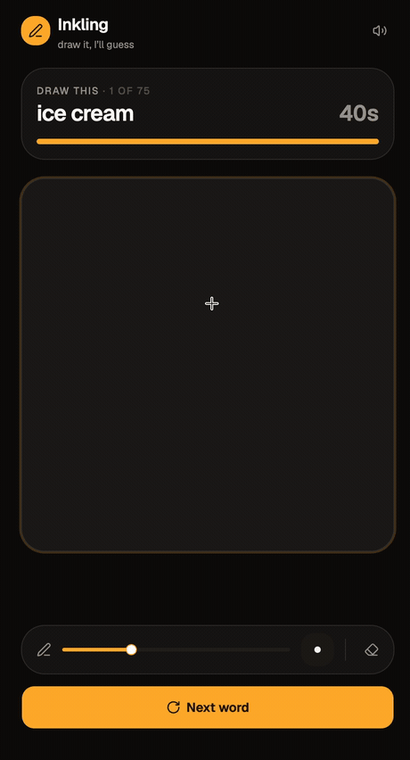

# Inkling

**Draw something and an AI guesses it out loud.** Runs entirely in your browser — no server, no API key, no cost.

[](screenshots/cover.png)

## Demo



▶ [Watch the HD clip (MP4)](screenshots/demo.mp4)

Pick up the pen, sketch the word you're given, and the AI narrates its guesses as you go — *"I see… headphones… ice cream!"* The round is won the moment it says your word.

## Features

- **The AI thinks out loud.** Every guess is spoken with the Web Speech API and shown as a live pill, so the canvas never feels quiet.
- **Guesses update as you draw.** The model re-reads the canvas ~4× a second; the picture is recognised the instant it becomes clear.
- **Brush size, no accuracy cost.** A 6–40px slider changes how your strokes look without ever changing what the model sees.
- **No repeats in a session.** Words are dealt from a shuffled deck, so you won't see the same one twice until you've been through them all.
- **Win / lose feedback.** Solve-time bar, celebratory sound, and a timer that pulses when you're running out.
- **100% offline after first load.** The model is fetched once from a CDN; everything else runs on your device.

## How to play

1. Press **Start** — you're given a word to draw and 40 seconds.
2. Sketch it on the canvas. The AI guesses aloud as the shape takes form.
3. Win the round the moment the AI says your word; otherwise the answer is revealed when time runs out.
4. **Next word** deals a fresh one; **Clear** wipes the canvas.

## Under the hood

The whole game is a static site — React + Vite, [shadcn/ui](https://ui.shadcn.com) on Tailwind v4. The interesting parts are where the browser fights back.

**The AI is [DoodleNet](https://github.com/yining1023/doodleNet)** — a CNN trained on all 345 [Quick, Draw!](https://quickdraw.withgoogle.com/data) categories — fetched once from a CDN (2.2 MB) and run on the GPU via TensorFlow.js. Inference takes ~10 ms, so recognition keeps up with the pen.

**Preprocessing has to mirror Quick Draw exactly, or the model guesses nonsense — silently.** Three of these fail with no error at all:

| rule | why |
|---|---|
| opaque white paper | `fromPixels` drops alpha; transparent pixels invert into a fully-inked canvas |
| invert to white-on-black | that's how the training bitmaps are stored |
| **don't binarize** | the bitmaps are anti-aliased and the model needs the gradient — grayscale scored 8/8 on real banana bitmaps, binarized scored 1/8 |
| normalize to the bounding box | a small drawing in a corner is otherwise unguessable |

**The brush slider never reaches the model.** Stroke width is a model parameter, not a style choice — the 420px canvas is scaled to 28px, so thin strokes vanish and thick ones read as filled shapes (a 40px square is classified `picture_frame`). Every stroke is drawn twice: once at your size on the visible canvas, once at a fixed 16px on an offscreen twin that is the only thing the model reads.

**The narration loop owns the win.** The model ranks the target long before the AI finishes speaking it; if the win fired on the ranking, you'd win before ever hearing the guess. So one loop owns both the voice and the win, and they can never disagree.

**No repeats** comes from a shuffled deck (`createWordBag`), not random draws — with 75 words, independent random draws hit a repeat by round 11.

Full engineering notes live in the source comments.

## Run it yourself

```bash
npm install
npm run dev      # http://localhost:5173
npm run build    # static build in dist/
```

Deploys anywhere that serves static files — Vercel auto-detects the Vite setup with zero config.

## Credits

- [Quick, Draw! Dataset](https://github.com/googlecreativelab/quickdraw-dataset) — Google Creative Lab
- [DoodleNet](https://github.com/yining1023/doodleNet) — Yining Shi, via [ml5.js](https://ml5js.org)

## Feedback

Found a bug or have an idea? Reach me at **reynard.satria@gmail.com**.
